# 🤗 welcoooooooooommmee wwwwwwwwwwwwwelcome !! 🤗🙂

## Come, get to experience, understand and live with Unicode code points (read as drown 🤨)

# Tokenization (for Hindi [Devanagari script])

#### (the gnarly part of every NLP model ... with NLTK back in pre-transformer days and now with LLMs)

For example, the string Hello world! gets encoded by the GPT-2 tokenizer as the sequence [15496, 995, 0], meaning that
it's a sequence of three tokens, the first of which is the 15,946th token of the vocabulary, or Hello, the second of
which is the 995th token of the vocabulary, or world, and the third of which is the 0th token of the vocabulary, or !.

In general, a long string being represented by a single token implies that that string appears a lot in the training
set (or whatever corpus was used to build the tokenizer), because otherwise it wouldn't have been "worth it" to give
that string its own token.

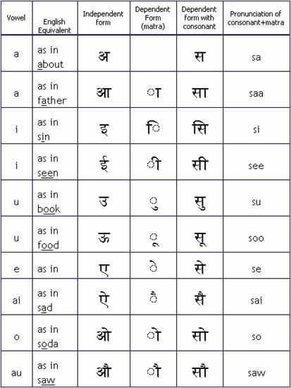

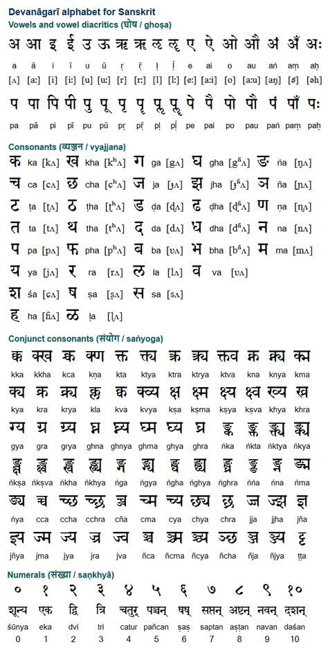

## Some info about devanagari script:

src : https://hindilanguage.info/devanagari/

1. The ordering of the letters is according to (some) precise scientific principles.
2. Each letter transcribes a distinct sound.
3. It recognizes subtle distinctions in sound.

## Hindi Alphabet:

https://www.easyhindityping.com/hindi-alphabet

### nostalgia !!

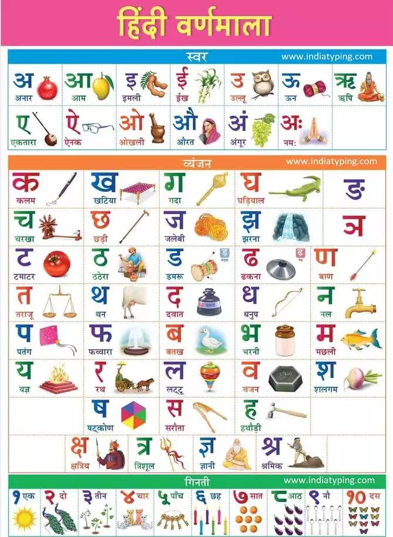

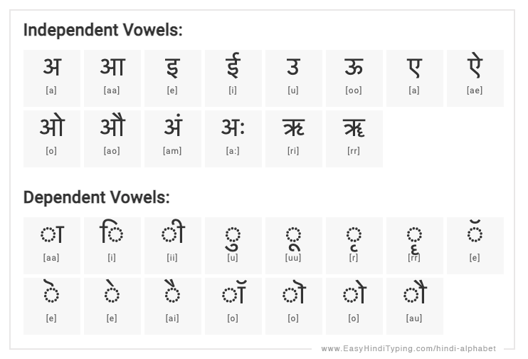

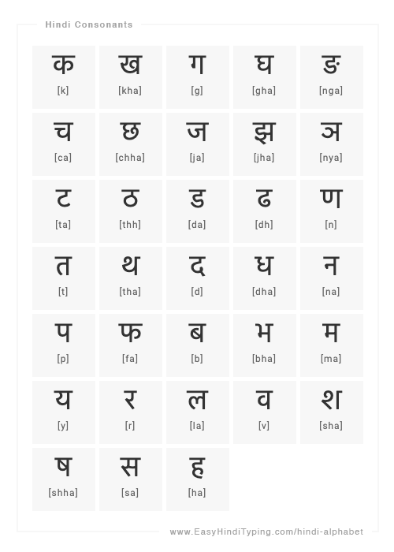

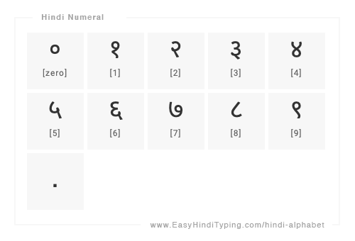

## Important for getting info on UTF-8 and encoding in general

1. [2003 blog from co-founder and ex-CEO (2010-2019) of Stackoverflow : The Absolute Minimum Every Software Developer Absolutely, Positively Must Know About Unicode and Character Sets (No Excuses!)](https://www.joelonsoftware.com/2003/10/08/the-absolute-minimum-every-software-developer-absolutely-positively-must-know-about-unicode-and-character-sets-no-excuses/)
2. [StackOverflow QnA: some good answers](https://stackoverflow.com/questions/2241348/what-are-unicode-utf-8-and-utf-16)
3. https://medium.com/free-code-camp/a-beginner-friendly-guide-to-unicode-d6d45a903515

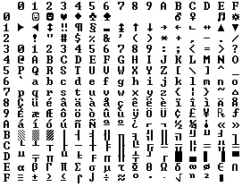

----
> Code points are the key concept of Unicode, which was “designed to support the worldwide interchange, processing, and
> display of the written texts of the diverse languages…of the modern world.”

> It does so by associating virtually every printable character with an unique code point. Together, these characters
> comprise the Unicode character set.
----

## Fun with glitch tokens:

#### Taken on 29th June 2024 (Andrej's Tokenization video is 4th month old now... these issues still on ChatGPT, hackerNews discussion 1 year old !)

1. 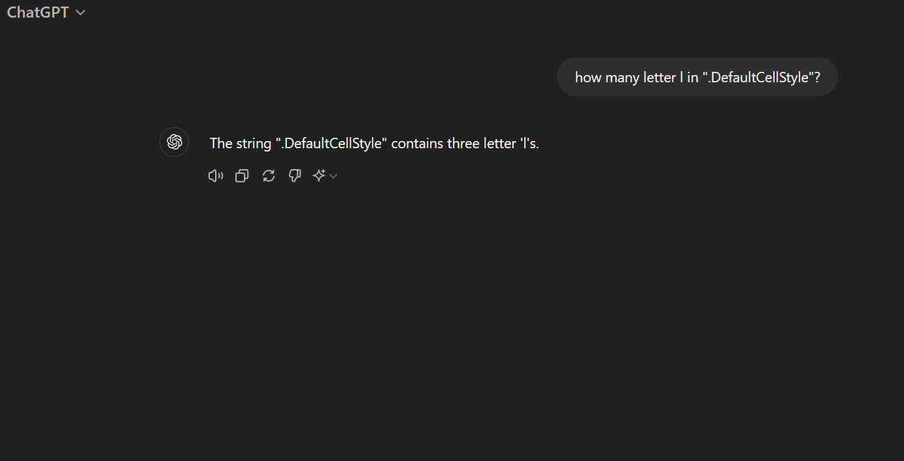
2. 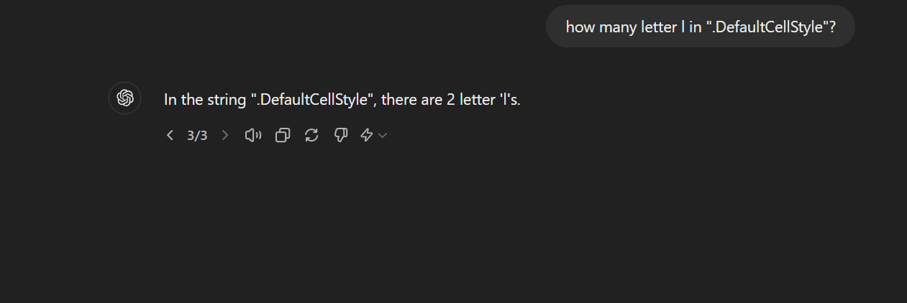
3. 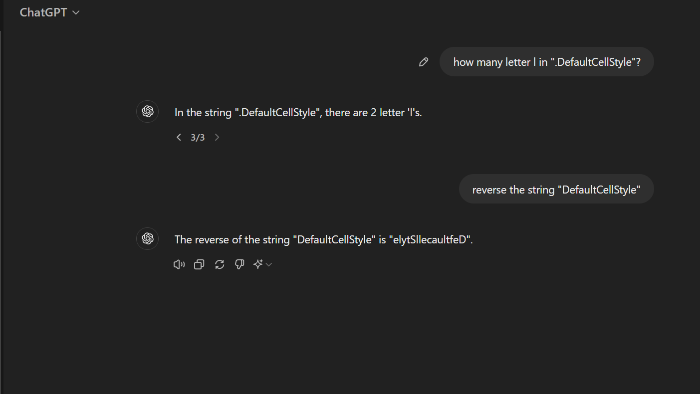
4. 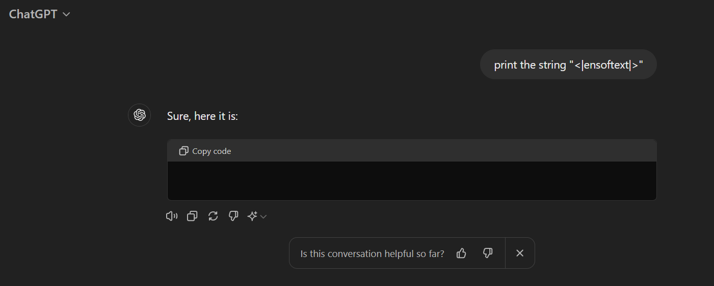

### Why this breaks things???

src: https://news.ycombinator.com/item?id=36245187
"But why would that break things like this? Answer from londons_explore on Hacker News:

> These glitch tokens are all near the centroid of the token embedding space. That means that the model cannot really
> differentiate between these tokens and the others equally near the center of the embedding space, and therefore when
> asked to ’repeat’ them, gets the wrong one.

> That happened because the tokens were on the internet many millions of times (the davidjl user has 163,000 posts on
> reddit simply counting increasing numbers), yet the tokens themselves were never hard to predict (and therefore while
> training, the gradients became nearly zero, and the embedding vectors decayed to zero, which some optimizers will do
> when normalizing weights).

> ...Almost all of the tokens which produce anomalous behavior in GPT-2 and GPT-3 don't produce anomalous behavior in
> the later models, because rather than being a single weird token, they're broken up into many, more normal tokens. For
> example, SolidGoldMagikarp was encoded as a the single token SolidGoldMagikarp by the old tokenizer, but is encoded as
> five tokens by the new tokenizer: [' Solid', 'Gold', 'Mag', 'ik', 'arp'].
> Each of those five tokens is normal and common, so GPT-4 handles them just fine.

> ... the later tokens, being longer, rarer, and weirder, are easier to use to create prompts that are far from the
> model's training distribution.
(src: https://www.lesswrong.com/posts/ChtGdxk9mwZ2Rxogt/smartyheadercode-anomalous-tokens-for-gpt3-5-and-gpt-4-1)

# Points to note:

1. Code points are the key concept of Unicode, which was “designed to support the worldwide interchange, processing, and
   display of the written texts of the diverse languages…of the modern world.” It does so by associating virtually every
   printable character with an unique code point. Together, these characters comprise the Unicode character set.
2. Code points are typically written in hexadecimal and prefixed with U+ to denote the connection to Unicode : ,
   emojis [🙌 | code point: U+1F64C]
3. Glyphs Are What You See
4. The actual on-screen representation of code points are called glyphs, (the complete mapping of code points to glyphs
   is known as a font). Glyphs are the physical manifestation of a character. This guy 💩 is a glyph. A font is a mapping
   of code points to glyphs.
5. 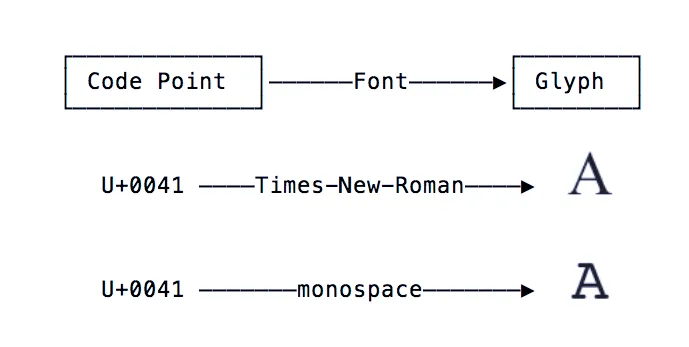
6. Under the hood, all variations of the face with open mouth emoji point to the same code point, U+1F62E, but the glyph
   representing it varies by platform 😮.
7. Code Points are Abstractions: Because they say nothing about how they are rendered visually (requiring a font and a
   glyph to “bring them to life”), code points are said to be an abstraction.
8. This is because code points require a character encoding to convert them into the one thing which computers can
   interpret: bytes.
9. UTF-8 uses a set of rules to convert a code point into an unique sequence of (1 to 4) bytes, and vice versa. Code
   points are said to be encoded into a sequence of bytes, and sequences of bytes are decoded into code points.
10. UTF-8 and UTF-16 encodings of emoji 😮: 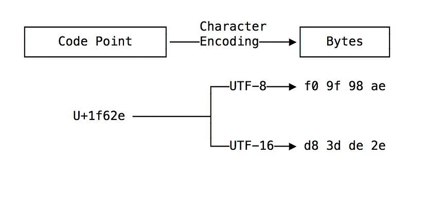
11. In order to send them across the network or save them in a file, characters and their underlying code points must be
    encoded into bytes. A character encoding contains the details of how a code point is embedded into a sequence of
    bytes.
12. 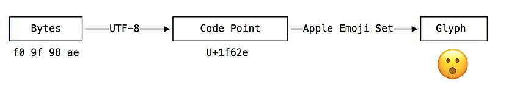
13. 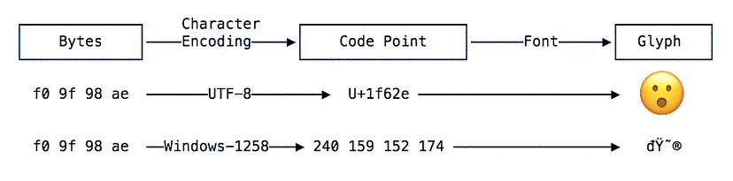
14. If you are working with code points, know that those code points must be encoded into bytes with a character
    encoding.
15. If you have a sequence of bytes representing text, know that those bytes are meaningless without knowing the
    character encoding that was used create those bytes.

## Devanagari script & Unicode(links) :

1. [Devanagari](https://unicode.org/charts/PDF/U0900.pdf)  Range: 0900–097F
2. [Devanagari Extended](https://unicode.org/charts/PDF/UA8E0.pdf)  Range: A8E0–A8FF
3. https://en.wikipedia.org/wiki/Plane_%28Unicode%29#Basic_Multilingual_Plane
4. https://en.wikipedia.org/wiki/Devanagari_(Unicode_block)

## Regex info for code point classes:

src: https://www.regular-expressions.info/unicode.html

1. Most people would consider `à` a single character. Unfortunately, it need not be depending on the meaning of the word
   “character”.

2. All Unicode regex engines treat any single Unicode code point as a single character. When online sources say that the
   dot matches any single character, this translates into Unicode parlance as “the dot matches any single Unicode code
   point”. In Unicode, à can be encoded as two code points: U+0061 (a) followed by U+0300 (grave accent). In this
   situation, `.` applied to `à` will match a without the accent. ^.$ will fail to match, since the string consists of
   two code points. ^..$ matches à.
3. The Unicode code point U+0300 (grave accent) is a combining mark.
4. Any code point that is not a combining mark can be followed by any number of combining marks. This sequence, like
   U+0061 U+0300 above, is displayed as a single **grapheme** on the screen.
5. To match a specific Unicode code point, use `\uFFFF` where `FFFF` is the hexadecimal number of the code point you
   want to match.
6. You must always specify 4 hexadecimal digits E.g. \u00E0 matches à, but only when encoded as a single code point
   U+00E0.
7. Since `\x` by itself is not a valid regex token, `\x{1234}` can never be confused to match `\x` 1234 times.
8. **Unicode Categories**
    1. each Unicode character belongs to a certain category.
    2. You can match a single character belonging to the “letter” category with `\p{L}`
    3. you can match a single character not belonging to that category with `\P{L}`
    4. Again, “character” really means “Unicode code point”
    5. `\p{L}` matches a single code point in the category `“letter”`
    6. If your input string is `à` encoded as U+0061 U+0300, it matches a without the accent
    7. If the input is `à` encoded as U+00E0, it matches à with the accent
    8. The reason is that both the code points U+0061 (a) and U+00E0 (à) are in the category “letter”, while U+0300 is
       in the category “mark”.

### Unicode Scripts:

1. The Unicode standard places each assigned code point (character) into one script
2. A script is a group of code points used by a particular human writing system
3. Some scripts like `Thai` correspond with a _single_ human language
4. Other scripts like `Latin` span _multiple languages_
5. Some languages are composed of multiple scripts
6. There is **no** Japanese Unicode script
7. Instead, Unicode offers the Hiragana, Katakana, Han, and Latin scripts that Japanese documents are usually composed
   of
8. A special script is the `Common` script. This script contains all sorts of characters that are common to a wide range
   of scripts. It includes all sorts of punctuation, whitespace and miscellaneous symbols.

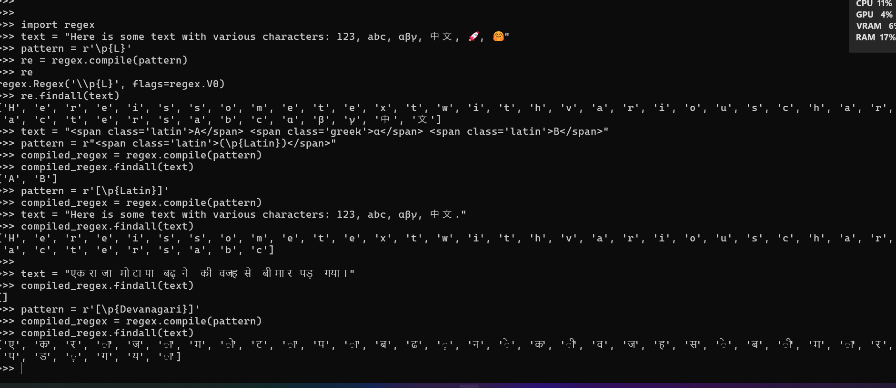

#### 100k GPT-4 Tokens list: https://gist.github.com/s-macke/ae83f6afb89794350f8d9a1ad8a09193

#### LLAMA3 Tokenizer in browser: https://belladoreai.github.io/llama3-tokenizer-js/example-demo/build/

## Resources for dataset preparation:

#### Note: Used Git Large File System, easy to use and track specific files

1. [hindi_text_ltrc](https://github.com/cltk/hindi_text_ltrc/tree/master)
    1. contains classical texts
    2. Kabeera
    3. Rahim
    4. Tulsidaas
    5. Meera
    6. Jayasl
    7. cakra

2. [Short Hindi stories from this link](https://worldstories.org.uk/lang/hindi)
    1. बंदर और मगरमच्छ
    2. खोया हुआ ऊँट
    2. घंमडी मोर
    3. चालाक बूढ़ी औरत
    4. जोहा और उसका गधा
    5. तीन बकरे जिनका नाम ग्रफ्फ था
    6. दयालु बकरियां
    7. बंदरों का राजा और भूत
    8. फ़ीनिक्स चिड़िया
    9. सच्चा होना
    10. सूरज और चंदा आसमान में क्यों रहते हैं

3. https://thehindigiri.com/he-bharat-ke-ram-jago/
4. https://storymirror.com/read/hindi/story/meraa-vtn/y3tv2cqj
4. https://www.kathaamrit.com/laziness-story-for-kids-in-hindi/
5. https://www.kathaamrit.com/elephant-and-car-story/
6. https://www.kathaamrit.com/friendship-story-for-kids/
7. https://www.kathaamrit.com/fairy-tail-story-for-kids/
8. https://www.kathaamrit.com/category/panchatantra-stories/
9. https://www.kathaamrit.com/category/spiritual-knowledge/chalisa/
10. https://www.kathaamrit.com/category/spiritual-knowledge/bhajan/
11. https://www.kathaamrit.com/pita-ki-seekh/
12. https://www.kathaamrit.com/panchtantra-kahaniya-hindi/
13. https://www.kathaamrit.com/panchtantra-ki-kahani/
14. https://storymirror.com/read/hindi/story/raamraajy/meho36ge
15. Complete first 5 parts from Rashmirathi: https://www.ishangirdhar.com/rashmi-rathi/
16. Another by Dinkar: https://hindi-kavita.com/HindiParshuramKiPrateekshaDinkar.php#Parshuram11
17. [वर्णमाला](https://anp.wikipedia.org/wiki/%E0%A4%B5%E0%A4%B0%E0%A5%8D%E0%A4%A3%E0%A4%AE%E0%A4%BE%E0%A4%B2%E0%A4%BE#:~:text=%E0%A4%B5%E0%A4%B0%E0%A5%8D%E0%A4%A3%E0%A5%8B%E0%A4%82%20%E0%A4%95%E0%A5%8B%20%E0%A4%B5%E0%A5%8D%E0%A4%AF%E0%A4%B5%E0%A4%B8%E0%A5%8D%E0%A4%A5%E0%A4%BF%E0%A4%A4%20%E0%A4%95%E0%A4%B0%E0%A4%A8%E0%A5%87%20%E0%A4%95%E0%A5%87,%E0%A5%AA%20%E0%A4%B8%E0%A4%82%E0%A4%AF%E0%A5%81%E0%A4%95%E0%A5%8D%E0%A4%A4%20%E0%A4%B5%E0%A5%8D%E0%A4%AF%E0%A4%9E%E0%A5%8D%E0%A4%9C%E0%A4%A8%20%E0%A4%B9%E0%A5%8B%E0%A4%A4%E0%A5%87%20%E0%A4%B9%E0%A5%88%E0%A4%82%E0%A5%A4)
18. Hinglish (English + Hindi) dataset from CMU's professor on
    HuggingFace: https://huggingface.co/datasets/festvox/cmu_hinglish_dog?row=2

#### Tokenization algorithm

Tokenization follows the training process closely, in the sense that new inputs are tokenized by applying the following
steps:

1. Normalization
2. Pre-tokenization
3. Splitting the words into individual characters
4. Applying the merge rules learned in order on those splits

## Created a simple Web Crawler too via Scrapy library... I mean... why not ?? 😅

1. Output in crawled-new-hindi-data-mix.json
2. needs to be processed and cleaned up to combine rows of text data together
3. although Hindi + extended Devanagari unicode points is all what is extracted
4. Used
   `Devanagari + Vedic + Extended Devanagari Unicode blocks`
   > ```hindi_pattern = r"[\u0900-\u097F\u1CD0-\u1CFF\uA8E0-\uA8FF]+"```

   > ```compiled = re.compile(pattern=hindi_pattern, flags=re.IGNORECASE)```
5. start URLs for Web-Crawler:

   Picked few Hindi news websites (sue me ??🤨) and Wikipedia Hindi

   > start_urls = [
   > 1. 'https://www.aajtak.in/',
   > 2. 'https://www.amarujala.com/?src=mainmenu',
   > 3. 'https://ndtv.in/',
   > 4. 'https://ndtv.in/cricket/zim-vs-ind-2nd-t20i-abhishek-sharma-bat-s-10minute-tsunami-thats-how-zimbabwe-was-robbed-in-two-parts-hindi-6054491#pfrom=home-khabar_moretop'
   > 5. 'https://storymirror.com/read/hindi/story/%E0%A4%86%E0%A4%B0%E0%A5%8D%E0%A4%9F%E0%A4%BF%E0%A4%95%E0%A4%B2/tag',
   > 6. 'https://www.achhikhabar.com/hindi-stories/',
   > 7. 'https://hindi.webdunia.com/kids-stories/story-done-compare-yourself-with-others-118060900051_1.html',
   > 8. 'https://www.sarita.in/story/social-story',
   > 9. 'https://www.bhaskar.com/',
   > 10. https://hi.wikipedia.org/wiki/%E0%A4%AE%E0%A5%81%E0%A4%96%E0%A4%AA%E0%A5%83%E0%A4%B7%E0%A5%8D%E0%A4%A0,
   > 11. https://hi.wikipedia.org/wiki/%E0%A4%B6%E0%A5%8D%E0%A4%B0%E0%A5%87%E0%A4%A3%E0%A5%80:%E0%A4%87%E0%A4%A4%E0%A4%BF%E0%A4%B9%E0%A4%BE%E0%A4%B8
         ]

> To run :$ scrapy runspider spiders/myspider.py -o crawled-new-hindi-data-mix.json

> Wrote code to pick dictionaries from this json and extract relevant data and join each sentence before writing to .txt
> file again as final step.

## Notes:

The key idea was:

1. To train more vocab for picking up smaller parts or individual bytes of codepoints before moving to complex words
   that occur frequently.
2. Later iterations use same merges and vocab but the allowed vocab increase size is lower than initial vocab size
3. This helps
    1. To experiment with various hyper-parameters
    2. and track quality of tokens generated and subsequent merges
    3. Allow BPE to pick most common byte-pairs more from initial dataset... to pick phonemes
4. Since I have a generator for reading entire dataset so had to modify code to include running vocab and merges
5. This also introduced issue of finding same pairs in every batch so resolved by using same Tokenizer instance.
6. But point 5 is a minor thing, main was to not have enough NEW pairs to find and merge in subsequent batches.
7. Added Hinglish dataset too to have real world usage examples in day to day life (like chats and forums where mix of
   English and Hindi is prevalent)

## Observation:

1. Hinglish (in real use cases) would pose another challenge !!!! But must be included. Bcoz aaj|aj kal|kl yhi|yehi
   normal|norm hai|h ! See how varying pronunciation AND enunciation results in varying english representation of Hindi
   language these days.
2. Any other language than English is under threat now unless Neuralink is adopted so thoughts and speech are
   transcribed and stored into DB, OR get multilingual keyboards(less likely to work and adopted ?)
3. Finding `diverse enough` dataset is the key... and for language(s) such as Hindi (or even other Indian languages)
   which are (nowadays) a little less in written form (although Wikipedia in Hindi is really helpful).
4. Local languages especially Asian (apart from Chinese, Japanese) need to focused upon for long term
   preservation/storage/usage.
